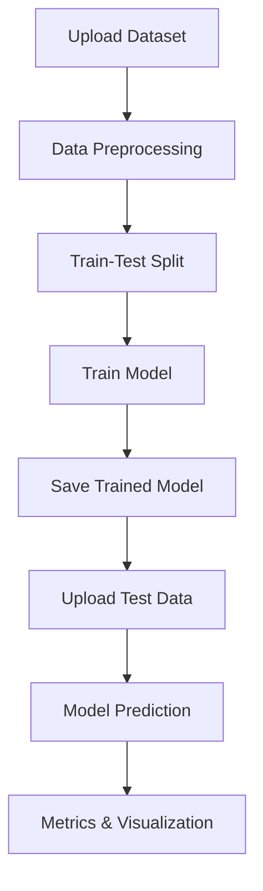

**An Effective Classification of DDoS Attacks using Machine Learning**

## 📖 Overview
An Effective Classification of DDoS Attacks using Machine Learning is a web-based detection system built with Django and machine learning models to accurately identify Distributed Denial-of-Service (DDoS) attacks in network traffic.
In today’s digital landscape, DDoS attacks are one of the most severe cybersecurity threats, capable of overwhelming services, disrupting operations, and causing major financial and reputational damage. This project leverages state-of-the-art ML algorithms like Random Forest, LightGBM, and KNN to classify traffic as either NORMAL or DDOS, ensuring fast, accurate, and automated detection.
Designed with role-based access control, the platform allows admins to upload datasets, train models, and monitor performance metrics, while regular users can upload test traffic and instantly view predictions. The system also stores trained models for future use, minimizing retraining time and optimizing deployment.
By combining data preprocessing, intelligent feature encoding, and robust evaluation metrics, this project demonstrates how machine learning can serve as a proactive defense mechanism against modern network threats.

## Why this project?
DDoS attacks are among the most disruptive cybersecurity threats. This project demonstrates how machine learning can be used to detect such attacks effectively.

## ✨ Key Features
| Feature | Description |
|---------|-------------|
| 🔐 **User Authentication** | Secure login & signup with Admin/User roles |
| 📂 **CSV Upload** | Upload datasets in `.csv` format |
| ⚙ **Data Preprocessing** | Cleans, encodes, and splits data for ML |
| 🤖 **Multiple ML Models** | Random Forest, LightGBM, KNN |
| 📊 **Performance Metrics** | Accuracy, Precision, Recall, F1-Score, Confusion Matrix |
| 💾 **Model Persistence** | Save & load trained models via Joblib |
| 🖥 **Prediction Interface** | Upload test data for instant classification |

## 🛠 Tech Stack
| Category | Tools |
|----------|-------|
| **Backend** | Django |
| **Machine Learning** | scikit-learn, LightGBM |
| **Data Processing** | Pandas, NumPy |
| **Visualization** | Matplotlib, Seaborn |
| **Model Storage** | Joblib |
| **Authentication** | Django's built-in auth system |

## ⚡ Workflow Diagram

## 🧹 Data Preprocessing Steps
📥 Data Collection – Upload raw network traffic dataset.

🧾 Handling Missing Values – Remove/impute null values.

🔍 Feature Selection – Select first 22 relevant features.

🔢 Label Encoding – Convert categorical columns (src, dst, Protocol) into numeric values.

🧹 Data Cleaning – Remove duplicates & inconsistent entries.

✂ Train-Test Split – 80% training, 20% testing using train_test_split.

📏 Feature Scaling (Optional) – Standardize data if needed for ML models.

## 📊 Model Performance (Example Values – Replace with Your Results)

| Model            | Accuracy | Precision | Recall | F1-Score |
|------------------|----------|-----------|--------|----------|
| 🌲 Random Forest | 98%      | 97%       | 98%    | 97%      |
| 💡 LightGBM      | 97%      | 96%       | 97%    | 96%      |
| 🔍 KNN           | 95%      | 94%       | 95%    | 94%      |

## 📂 Project Structure
An-Effective-Classification-of-DDoS-Attacks-using-ML/
│── application/
│   ├── views.py           # Core logic
│   ├── models.py          # Django models
│   ├── admin.py           # Admin config
│   ├── apps.py            # App settings
│   ├── tests.py           # Unit tests
│── templates/
│   ├── Home.html
│   ├── prediction.html
│   ├── login.html
│   ├── register.html
│── static/                # CSS, JS, Images
│── RandomForestClassifier.pkl
│── KNN.pkl
│── test.csv
│── manage.py

## ⚡ How It Works
1. **Upload Training Data** → Data is preprocessed and split.
2. **Train Model** → Choose ML algorithm (RandomForest, LightGBM, KNN).
3. **Save Model** → Model is stored for later predictions.
4. **Upload Test Data** → Predict and display results with metrics.

## 📌 Usage
Admin Login → Upload training dataset → Select ML algorithm → Train model.

User Login → Upload test dataset → View predictions.

Metrics → See accuracy, precision, recall, and F1-score in the interface.

## 🔮 Future Enhancements
Real-time DDoS detection from live network traffic.

Deep learning integration (LSTM/GRU).

Advanced analytics dashboard with live charts.

